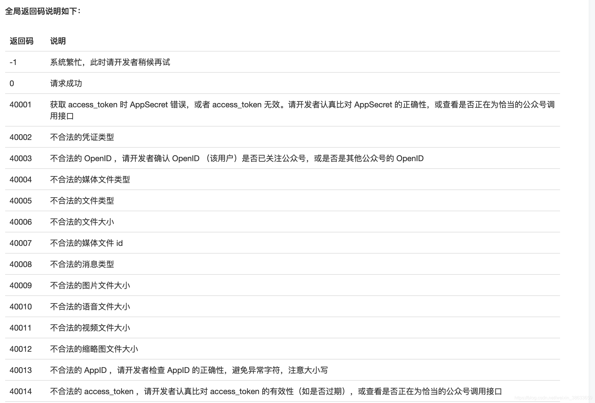
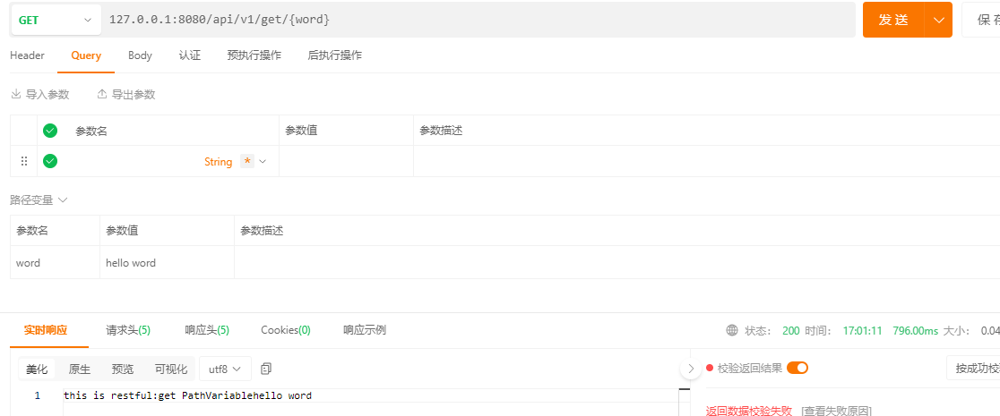
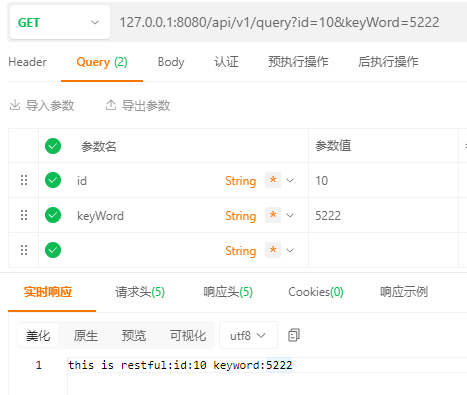
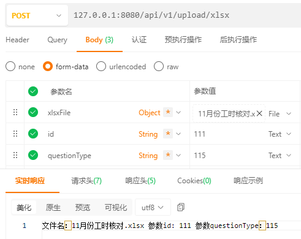

# RESTful接口设计规范
RESTful是目前最流行的API设计规范，它是用于Web数据接口的设计。从字面可以看出，他是Rest式的接口，所以我们先了解下什么是Rest。

REST与技术无关，它代表的是一种软件架构风格，REST它是 Representational State Transfer的简称，中文的含义是: “表征状态转移” 或 “表现层状态转化”。

它是基于HTTP、URI、XML、JSON等标准和协议，支持轻量级、跨平台、跨语言的架构设计。

开发工作中，我们有时需要提供API接口给客户端或者第三方使用，那么如何构建一个能让使用者快速理解的API是一项重要的工作。倘若我们在设计API时就严格遵守一些规范，那么在后面的开发过程中沟通成本和效率就会大大改善。
## 1 RESTful,简称REST。
1、英文：Representational State Transfer。
2、直译：表现层状态转化。
3、本质：用URL定位资源，用HTTP动词（GET,POST,DELETE,DETC）描述操作。
4、特点：RESTful是一种软件架构风格、设计风格，而不是标准，只是提供了一组设计原则和约束条件。它主要用于客户端和服务器交互类的软件。 基于这个风格设计的软件可以更简洁，更有层次，更易于实现缓存等机制。
5、设计原则和约束条件：
5.1、网络上的所有事物都可以被抽象为资源(resource)；
5.2、每一个资源都有唯一的资源标识(resource identifier)，对资源的操作不会改变这些标识；
5.3、所有的操作都是无状态的。
凡事满足这些约束条件和原则的应用程序或设计就是 RESTful。
6、通俗解释：服务器上每一种资源，比如一个文件，一张图片，一部电影，都有对应的唯一的url地址（URI：统一资源标识符），如果我们的客户端需要对服务器上的这个资源进行操作，就需要通过http协议（GET、POST、PUT、PATCH、DELETE）执行相应的动作来操作它，比如进行获取，更新，删除。
7、补充：
7.1、 在 RPC 样式的架构中，关注点在于方法，而在 REST 样式的架构中，关注点在于资源 —— 将使用标准方法检索并操作信息片段（使用表示的形式）。资源表示形式在表示形式中使用超链接互联。
7.2、关于http接口、api接口、RPC接口、RMI、webservice、Restful等概念。

## 2 Rest设计原则
那么怎么样可以设计成REST的架构规范呢? 需要符合如下的一些原则：

每一个URI代表一种资源;
同一种资源有多种表现形式(xml/json);
所有的操作都是无状态的。
规范统一接口。
返回一致的数据格式。
可缓存(客户端可以缓存响应的内容)。
符合上述REST原则的架构方式被称作为 RESTful 规范。

理解为什么所有的操作需要无状态呢?

http请求本身是无状态的，它是基于 client-server 架构的，客户端向服务器端发的每一次请求都必须带有充分的信息能够让服务器端识别到，请求的一些信息通常会包含在URL的查询参数中或header中，服务器端能够根据请求的各种参数, 不需要保存客户端的状态, 直接将数据返回给客户端。无状态的优点是：可以大大提高服务器端的健状性和可扩展性。

客户端可以通过token来标识会话状态。从而可以让该用户一直保持登录状态。
## 3 Restful API接口设计规范
### 3.1、协议
包含 http 和 https，使用 https 可以确保交互数据的传输安全。

### 3.2、路径规则|域名
路径又称 “终点”（endpoint），表示 API 的具体网址。
在 RESTful 架构中，每个网址代表一种资源（resource），所以网址中不能有动词，只能有名词，而且所用的名词往往与数据库的表格名对应。一般来说，数据库中的表都是同种记录的 “集合”（collection），所以 API 中的名词也应该使用复数。
包含两种形式：
a、主域名：https://api.example.com
b、子目录：https://example.org/api/

### 3.3、版本控制
版本号：v {n} n 代表版本号，分为整形和浮点型
整型：大功能版本发布形式；具有当前版本状态下的所有 API 接口，例如：v1,v2。
浮点型：为小版本号，只具备补充 api 的功能，其他 api 都默认调用对应大版本号的 api 例如：v1.1 v2.2。
放入位置：
1、将版本号放入URL中（方便直观）。
2、将版本号放在请求头。

### 3.4、请求类型
GET（SELECT）：从服务器取出资源（一项或多项）。
POST（CREATE）：在服务器新建一个资源。
PUT（UPDATE）：在服务器更新资源（客户端提供改变后的完整资源）。
PATCH（UPDATE）：在服务器更新资源（客户端提供改变的属性）。
DELETE（DELETE）：从服务器删除资源。

### 3.5、传入参数
#### 3.5.1、地址栏参数
主要用于过滤查询
a、restful 地址栏参数 /api/v1/product/122 122 为产品编号，获取产品为 122 的信息
b、get 方式的查询字串，此种方式主要用于过滤查询，如下：

?limit=10：指定返回记录的数量
?offset=10：指定返回记录的开始位置。
?page=2&per_page=100：指定第几页，以及每页的记录数。
?sortby=name&order=asc：指定返回结果按照哪个属性排序，以及排序顺序（sequence、order）。
?producy_type=1：指定筛选条件

#### 3.5.2、请求body数据
主要用于提交新建数据

#### 3.5.3、请求头
用于存放请求格式信息、版本号、token 密钥、语言等信息
```
{
    Accept: 'application/json',     //json格式
    version: 'v1.0'                       //版本号
    Authorization: 'Bearer {access_token}',   //认证token
    language: 'zh'                      //语言
}
```
### 3.6、返回格式
默认返回格式：
```
{
    code: 0,                         //状态码
    msg: 'ok',                       //提示信息
    data: {}                          //主体数据
}
```
使用 json 格式作为响应格式，状态码分为两种：
a、statusCode: 系统状态码，用于处理响应状态，与 http 状态码保持一致，如：200 表示请求成功，500 表示服务器错误。
b、code：业务状态码，用于处理业务状态，一般 0 标识正常，可根据需求自行设计错误码对照表，参考


## [代码实现](./src/main/java/site/bleem/boot/demo/controller/RestfulController.java)
### GET请求参数在路径中
```
    @GetMapping("/api/v1/get/{word}")
    public ResponseEntity<String> getMethod(@PathVariable("word") String word) {
        return ResponseEntity.ok("this is restful:get PathVariable "+word);
    }
```

### GET请求参数封装成对象
```
    @GetMapping("/api/v1/query")
    public ResponseEntity<Object> queryMethod(QueryDTO dto) {
        return ResponseEntity.ok("this is restful:id:"+dto.getId() +" keyword:"+dto.getKeyWord());
    }
```


### POST请求参数带文件和参数
```
    @PostMapping(value = "/api/v1/upload/xlsx", consumes = {"multipart/form-data"})
    public ResponseEntity<Object> uploadXlsx(@RequestParam("xlsxFile") MultipartFile xlsxFile, @RequestParam("id") Integer id, @RequestParam("questionType") Integer questionType) {
        //基础校验
        if (xlsxFile == null || xlsxFile.isEmpty() || xlsxFile.getSize() == 0) {
            throw new RuntimeException("文件不能为空！");
        }
        String originalFilename = xlsxFile.getOriginalFilename();
        if (originalFilename == null) {
            throw new RuntimeException("文件名称不能为空！");
        }
        return ResponseEntity.ok("文件名："+originalFilename+" 参数id: "+id+" 参数questionType："+questionType);
    }
```

