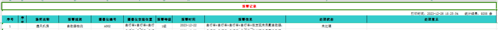

# easypoi实现表格导出
## 需求
原表格：

期望：


1. 增加一个自增的序号列；
2. 主标题下增加一个副标题：显示打印时间和数据
## 实现
### maven依赖
```
        <dependency>
            <groupId>cn.afterturn</groupId>
            <artifactId>easypoi-base</artifactId>
            <version>4.4.0</version>
        </dependency>
```
### 实现代码：
工具类：[ExcelExportProUtil](./src/main/java/site/bleem/boot/demo/util/ExcelExportProUtil.java)
自定义表格实现类：[UserDefinedExcelFileUtil](./src/main/java/site/bleem/boot/demo/util/UserDefinedExcelFileUtil.java)
自定义表格格式类：[UserDefinedExcelExportStyle](./src/main/java/site/bleem/boot/demo/util/UserDefinedExcelExportStyle.java)
定义序号列时空指针异常问题解决：[SubExcelExportService](./src/main/java/site/bleem/boot/demo/util/SubExcelExportService.java)

接口调用类：[ExcelController](./src/main/java/site/bleem/boot/demo/controller/ExcelController.java)