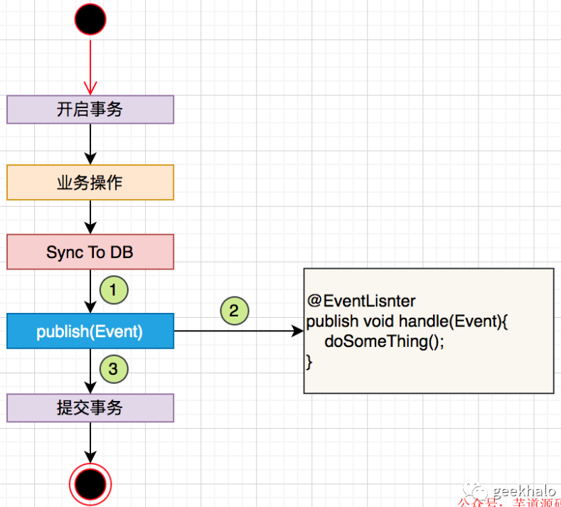
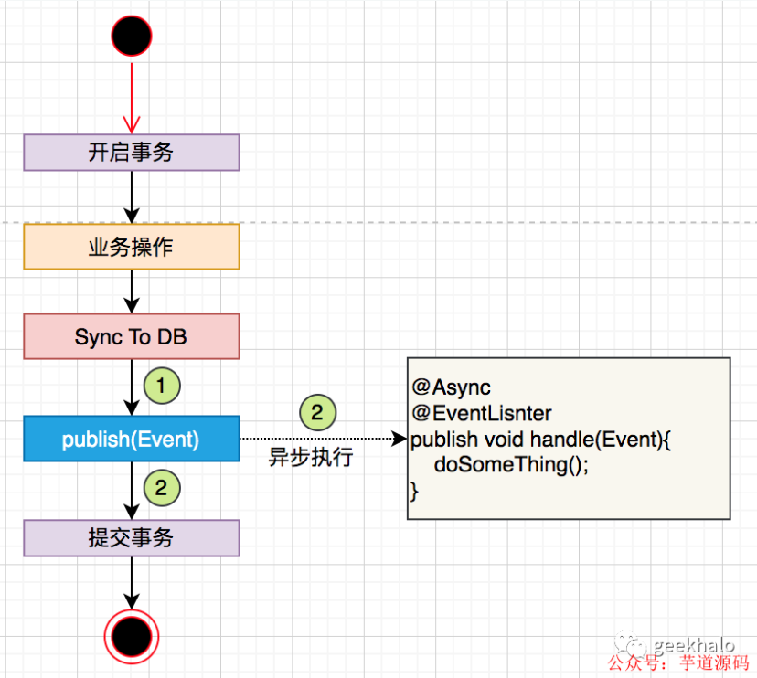
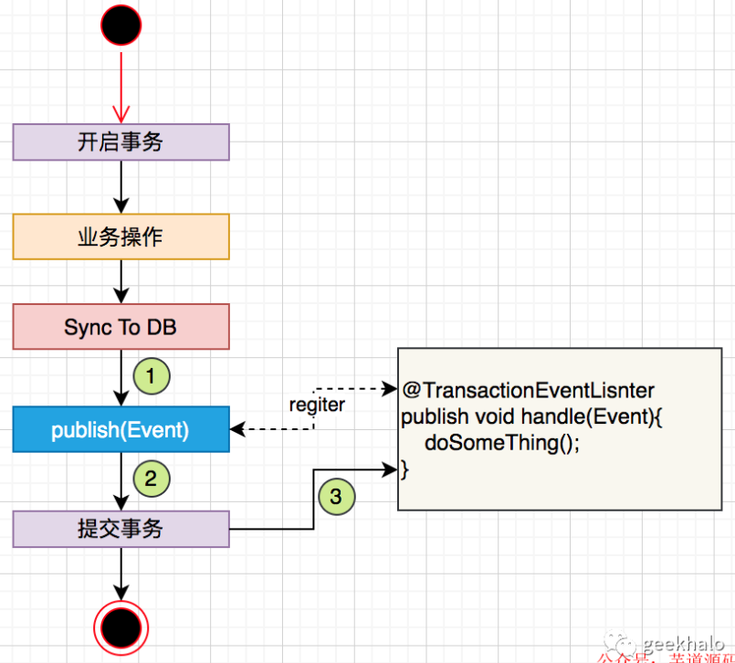
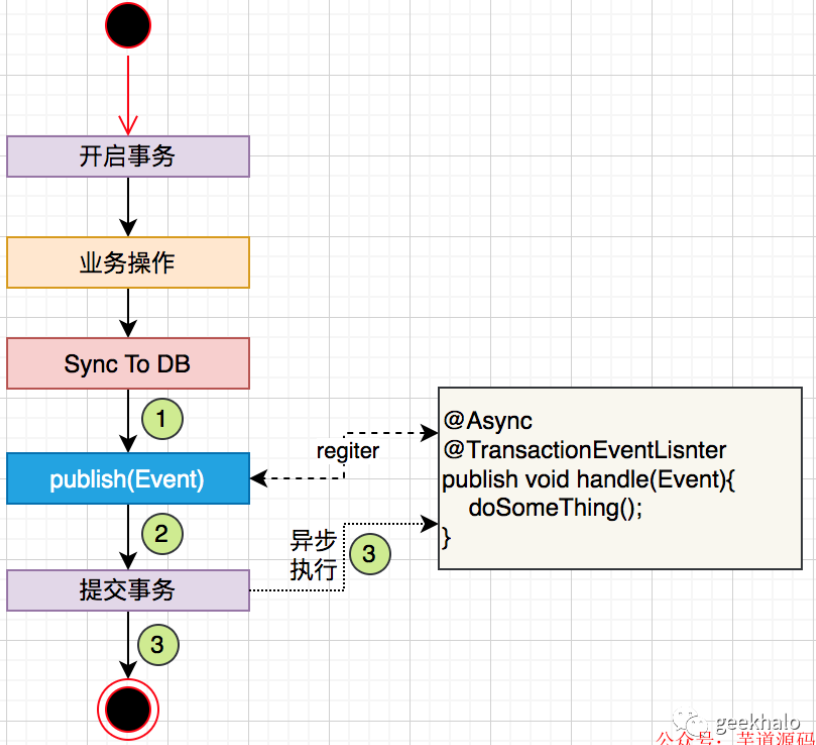

# 方法重试技术方案
## 需求
- 要求调用第三方接口，一定要请求成功；
- 当网络异常时，就可能会导致消息积压，一直请求可能导致系统中的堆栈溢出，影响正常业务流程；
- 需要保障系统主业务运行正常且流程；
- 对接第三方平台做成可拔插方式；
## 设计
 针对接口的方法使用重试框架来实现，并且需要进行持久化保存，这里简单实现引入缓存管理。
[Drawio](./FILES/方法重试技术方案.md/重试方案设计.drawio){link-type="drawio"}
实现思路为：
1. 将针对该平台的所有实现方法放在一个bean中并使用ConditionalOnProperty注解修饰，仅当配置指定配置时，才会加载该bean;
2. 初始化bean时同时初始化一个线程安全的队列，用作缓存等待任务；
3. 请求失败后，重试3次，若3次都失败则将本次请求加入缓存队列中等待；
4. 创建一个定时任务，每天凌晨开始执行；

### 技术点
- 重试框架：
    - springretry
    - guava-retry
- 使用apache-http client实现对接第三方；
- springbean模块化加载，功能和代码层解耦；
- 基于springboot框架设计一套线程安全的缓存管理器
## springbean模块化加载，功能和代码层解耦；
### 加载bean时根据配置定义，进行选择性加载
背景：比如说三方平台，目前可能只接入了A平台，后续可能会接入B平台，C平台等，还有可能有些用户只要B平台，不要A,C平台，各个平台都是处理类似的功能，但每个平台都有自己规范；
实现：
```java
/**
 * 当配置文件中：saaxcms.enabled: true 配置存在时，该Bean才会被spring进行初始化加载
 */
@Component
@ConditionalOnProperty(name = "saaxcms.enabled", havingValue = "true")
public class SaaxcmsThirdPartyServer {

}
```

### 一个接口多个实现类，运行时只有一个实现类被ioc容器加载
背景：如缓存管理器：一个缓存管理器接口可能被多个实现类进行实现。比如现在使用guava作为缓存，后续可能使用redis作为缓存，或spring自带的缓存。但同时只能存在一个具体实现；
具体需要看客户现场的技术环境提供的技术支持（业务特点）有哪些。
[Drawio](./FILES/方法重试技术方案.md/重试方案设计.drawio){link-type="drawio" page="2"}

通过配置类判断进行加载bean
```
@Configuration
public class CacheManagerConfig {


    @Bean
    @Conditional(ImplementationACondition.class)
    public CacheManager cacheManager(){
        return new GuavaCacheManager();
    }

    static class ImplementationACondition implements Condition {
        @Value("${spjr001.enabled}")
        private String enabledValue;
        @Override
        public boolean matches(ConditionContext context, AnnotatedTypeMetadata metadata) {
            // 在此处可以根据配置或其他条件判断是否启用 Implementation A
//            Environment environment = context.getEnvironment();
            // 获取配置参数的值
//            String enabledValue = environment.getProperty("guava.enable");

//            return "true".equalsIgnoreCase(enabledValue);
            return true;
        }
    }

}
```
**注意:** 对应的实现类不要用@Component修饰，否则会加载两次；

### 使用spring的观察者模式做到代码层进行解耦
#### @EventListener
Spring 的 EventListener 监听器是一种相对于传统的事件监听方式更为简洁和灵活的事件机制。与传统的事件机制不同，EventListener 不需要显示地继承特定的事件接口，而是使用注解标识需要监听的事件类型，然后通过一个单独的监听器类处理所有类型的事件。
优势主要有以下几点：

1. 更加灵活：EventListener 不依赖于任何特定的事件接口，从而使得事件处理更加灵活，可以监听和处理任意类型的事件。
1. 更加简洁：相比传统的事件监听方式，使用 EventListener 可以避免一系列繁琐的接口定义和实现，简化了代码结构，使得开发效率更高。
1. 更加松耦合：EventListener 将事件发布方和事件处理方分离，遵循松耦合的设计原则，提高了代码的可维护性和扩展性。
1. 更加可测试：由于 EventListener 可以监听和处理任意类型的事件，可以通过单元测试验证其功能是否正确，从而提高了测试的可靠性。
- 生产者实现示例：
```
@Component
public class MyEventPublisher {

    @Autowired
    private ApplicationEventPublisher eventPublisher;

    public void publishEvent(String message) {
        MyEvent event = new MyEvent(message);
        eventPublisher.publishEvent(event);
    }
}
```
- 消费者实现示例
```
@Component
public class MyEventListener{

    @EventListener
    public void onApplicationEvent(MyEvent event) {
        // 处理事件
        System.out.println("Received event: " + event.getMessage());
    }
}
```
备注：在使用 @Async 时，需要根据业务场景对线程池进行自定义，以免出现资源不够的情况（Spring 默认使用单线程处理@Async异步任务）
- 无 @Async	顺序、同步执行


特点：

顺序执行。调用 publish(Event) 后，自动触发对 @EventListner 注释方法的调用
同步执行。使用主线程执行，方法抛出异常会中断调用链路，会触发事务的回归
应用场景：

事务消息表。在同一事务中完成对业务数据和消息表的修改
业务验证。对业务对象进行最后一次验证，如果验证不通过直接抛出异常中断数据库事务
业务插件。在当前线程和事务中执行插件完成业务扩展
- 有 @Async	顺序、异步执行

特点：

顺序执行。调用 publish(Event) 后，自动触发对 @EventListner 注释方法的调用
异步执行。使用独立的线程池执行任务，方法抛出异常对主流程没有任何影响
应用场景：

记日志明细日志，辅助排查问题
#### @TransactionEventListener
在 Spring 中，TransactionEventListner 和 EventListner 都是用于处理事件的接口。不同之处在于

TransactionEventListner 是在事务提交后才会触发
而 EventListner 则是在事件发布后就会触发。
具体来说，在使用 Spring 的声明式事务时，可以在事务提交后触发某些事件。这就是 TransactionEventListner 的应用场景。而 EventListner 则不涉及事务，可以用于在事件发布后触发一些操作。

下面是一个简单的示例，演示了如何使用 TransactionEventListner 和 EventListner：
```
@Component
public class MyEventListener {

    @EventListener
    public void handleMyEvent(MyEvent event) {
        // 处理 MyEvent
    }

    @TransactionalEventListener
    public void handleMyTransactionalEvent(MyTransactionalEvent event) {
        // 处理 MyTransactionalEvent
    }
}

@Service
public class MyService {

    @Autowired
    private ApplicationEventPublisher eventPublisher;

    @Autowired
    private MyRepository myRepository;

    @Transactional
    public void doSomething() {
        // 做一些事情
        MyEntity entity = myRepository.findById(1L);
        // 发布事件
        eventPublisher.publishEvent(new MyEvent(this, entity));
        // 发布事务事件
        eventPublisher.publishEvent(new MyTransactionalEvent(this, entity));
    }
}
```
在这个例子中，MyEventListener 类定义了两个方法，handleMyEvent 和 handleMyTransactionalEvent，分别处理 MyEvent 和 MyTransactionalEvent 事件。其中，handleMyTransactionalEvent 方法用 @TransactionalEventListener 注解标记，表示它只会在事务提交后触发。

MyService 类中的 doSomething 方法使用 ApplicationEventPublisher 来发布事件。注意，它发布了两种不同类型的事件：MyEvent 和 MyTransactionalEvent。这两个事件会分别触发 MyEventListener 中的对应方法。

总的来说，Spring 的事件机制非常灵活，可以方便地扩展应用程序的功能。TransactionEventListner 和 EventListner 这两个接口的应用场景有所不同，可以根据实际需求选择使用

特点：

事务提交后执行。调用 publish(Event) 时，只是向上下文中注册了一个回调器，并不会立即执行；只有在事务提交后，才会触发对 @TransactionEventListner 注释方法的调用
同步执行。使用主线程执行，方法抛出异常会中断调用链路，当不会回归事务（事务已提交，没有办法进行回归）
应用场景：

数据同步。事务提交后，将变更同步到 ES 或 Cache
记录审计日志。只有在业务变更成功更新到数据库时才进行记录
备注：@TransactionEventLisnter 必须在事务上下文中，脱离上下文，调用不会生效


特点：
事务提交后执行。调用 publish(Event) 时，只是向上下文中注册了一个回调器，并不会立即执行；只有在事务提交后，才会触发对 @TransactionEventListner 注释方法的调用
异步执行。使用独立的线程池执行任务，方法抛出异常对主流程没有任何影响
应用场景：异步处理。记录操作日志，异步保存数据等 备注：@TransactionEventLisnter 必须在事务上下文中，脱离上下文，调用不会生效
## springretry

```
        <dependency>
            <groupId>org.springframework.retry</groupId>
            <artifactId>spring-retry</artifactId>
        </dependency>
```
Spring Retry 注解属性详解
1、@EnableRetry
作用于SpringbootApplication启动类，开启spring retry。
proxyTargetClass：默认值为false，设置为true时为CGLIB代理。
2、@Retryable 作用于需要进行重试的方法
value：指定处理的异常类，默认为空
include：指定处理的异常类，默认为空，当include和exclude为空时，默认所有异常
exclude：指定哪些异常不处理，默认空
maxAttempts：最大重试次数。默认3次
backoff： 重试补偿策略。默认使用@Backoff注解
3、@Backoff 作用于backoff中的补偿策略
delay：指定等待时间，没有设置的话默认为1000ms
maxDelay：最大重试时间，没有设置默认为3000ms
multiplier：下一次调用时间的乘数
random：随机等待时间，默认值为false
4、@Recover
用于对retry方法的异常抛出的特殊处理，可做熔断、降级、日志等操作。入参必须和retry对应方法所抛出的异常类型相同。

### 注解重试
```
 @Retryable(value = {Exception.class}, maxAttempts = 3, backoff = @Backoff(delay = 1000))
```
- 当maxAttempts=-1是运行会抛错；

### 代码自定义重试机制
由于考虑到需要做请求三次判断

```
    @Override
    public void handleAlarmMessage(String alarmMessage) {
        PushChannelGeneralDTO dto = JSONObject.parseObject(alarmMessage, PushChannelGeneralDTO.class);
        RetryCallback<Void, RuntimeException> retryCallback = context -> {
            int currentAttempt = context.getRetryCount() + 1;
            System.out.println("Executing attempt number: " + currentAttempt);
            File file = getFileByUrl(dto.getUrl());
            dto.setFile(file);
            // Simulate some operation that may fail
            pushGeneral(dto);
            return null; // The return type of RetryCallback's doWithRetry method
        };
        RetryTemplate retryTemplate = new RetryTemplate();
        // 设置重试次数
        SimpleRetryPolicy retryPolicy = new SimpleRetryPolicy();
        retryPolicy.setMaxAttempts(3);
        retryTemplate.setRetryPolicy(retryPolicy);
        // 设置重试间隔
        FixedBackOffPolicy backOffPolicy = new FixedBackOffPolicy();
        backOffPolicy.setBackOffPeriod(1000);
        retryTemplate.setBackOffPolicy(backOffPolicy);
        retryTemplate.execute(retryCallback);
    }
```
